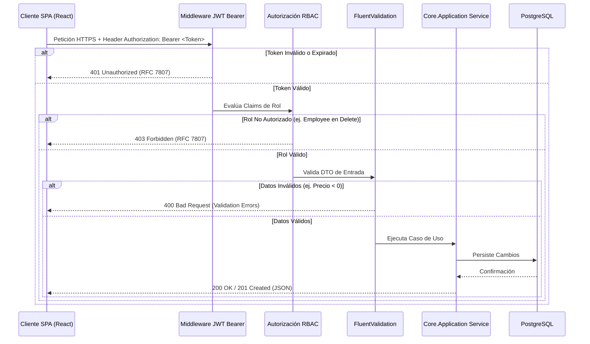

# Semana 3 — Fase 3: Autenticación Stateless (JWT), RBAC & Validación Defensiva
## Asignatura: Desarrollo de Aplicaciones Web (Código: 0423807T)
**Universidad Nacional Experimental del Táchira (UNET)**  
**Facilitador:** M.Sc. Ing. Gabriel Alexis Ramírez Sánchez

---

## 🔐 1. Autenticación Stateless con JSON Web Tokens (JWT RFC 7519)

En arquitecturas web modernas basadas en APIs REST y clientes de página única (SPA), la gestión tradicional de sesiones en memoria del servidor presenta serios cuellos de botella de escalabilidad horizontal.

La autenticación **Stateless (Sin Estado)** mediante **JWT** resuelve este problema al encapsular la identidad y privilegios del usuario dentro de un token firmado criptográficamente con el algoritmo **HMAC SHA-256**.

### Estructura de un Token JWT:
```
┌────────────────────────────────────────────────────────┐
│ Header: Algoritmo (HS256) y Tipo de Token (JWT)        │
├────────────────────────────────────────────────────────┤
│ Payload: Claims (Id de Usuario, Email, Roles, Expiry)  │
├────────────────────────────────────────────────────────┤
│ Signature: HMACSHA256(Base64(Header) + Base64(Payload),│
│                       Secret_Key)                      │
└────────────────────────────────────────────────────────┘
```

El servidor valida la firma criptográfica en cada petición HTTP sin necesidad de realizar consultas a la base de datos para verificar la sesión activa.

---

## 🛡️ 2. Matriz de Control de Acceso Basado en Roles (RBAC)

Para preservar la integridad de los procesos de la empresa, el sistema segmenta los privilegios mediante **RBAC (Role-Based Access Control)** diferenciando las funciones de **Admin** y **Employee**:

| Módulo / Operación | Rol Admin | Rol Employee | Código HTTP si es denegado |
| :--- | :---: | :---: | :---: |
| **Dashboard de Indicadores KPI** | ✅ Acceso Total | ❌ Oculto / Bloqueado | `403 Forbidden` |
| **Consultar Catálogo de Productos** | ✅ Permitido | ✅ Permitido | `200 OK` |
| **Registrar / Modificar Productos** | ✅ Permitido | ✅ Permitido | `200 OK / 201 Created` |
| **Eliminar Productos** | ✅ Permitido | ❌ Denegado | `403 Forbidden` |
| **Consultar Lista de Categorías** | ✅ Permitido | ✅ Permitido | `200 OK` |
| **Crear / Editar Categorías** | ✅ Permitido | ❌ Denegado | `403 Forbidden` |
| **Eliminar Categorías** | ✅ Permitido | ❌ Denegado | `403 Forbidden` |

### Implementación en Controladores de C#:
```csharp
[Authorize(Roles = "Admin")]
[HttpDelete("{id:guid}")]
public async Task<IActionResult> DeleteProduct(Guid id)
{
    await _productService.DeleteAsync(id);
    return NoContent();
}
```

---

## 🛑 3. Validación Defensiva Desacoplada con FluentValidation

La validación de entrada es la primera línea de defensa frente a vulnerabilidades críticas como **Mass Assignment** y **BOLA (Broken Object Level Authorization)** catalogadas en el **OWASP Top 10**.

Al utilizar **FluentValidation** en `Core.Application`, las reglas de validación se expresan de manera declarativa y fuera de los controladores:

```csharp
public class CreateProductValidator : AbstractValidator<CreateProductDto>
{
    public CreateProductValidator()
    {
        RuleFor(x => x.Name)
            .NotEmpty().WithMessage("El nombre del producto es obligatorio.")
            .MaximumLength(150).WithMessage("El nombre no puede exceder 150 caracteres.");

        RuleFor(x => x.SKU)
            .NotEmpty().WithMessage("El código SKU es obligatorio.")
            .MaximumLength(20).WithMessage("El SKU no puede superar 20 caracteres.");

        RuleFor(x => x.Price)
            .GreaterThan(0).WithMessage("El precio de venta debe ser mayor a 0.");

        RuleFor(x => x.CostPrice)
            .GreaterThanOrEqualTo(0).WithMessage("El costo de adquisición no puede ser negativo.");

        RuleFor(x => x.Stock)
            .GreaterThanOrEqualTo(0).WithMessage("El stock no puede ser negativo.");

        RuleFor(x => x.MaxStock)
            .GreaterThan(x => x.MinStock).WithMessage("El stock máximo debe ser mayor al stock mínimo.");

        RuleFor(x => x.CategoryId)
            .NotEmpty().WithMessage("Debe asignar una categoría válida al producto.");
    }
}
```

---

## 🔄 4. Pipeline Secuencial de Seguridad y Validación


