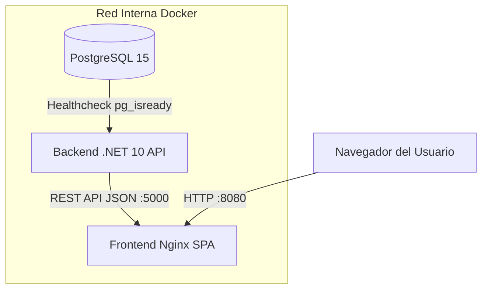

# Semana 5 — Fase 5: Contenerización Multi-stage, DevOps, CI/CD y Sustentación Técnica
## Asignatura: Desarrollo de Aplicaciones Web (Código: 0423807T)
**Universidad Nacional Experimental del Táchira (UNET)**  
**Facilitador:** M.Sc. Ing. Gabriel Alexis Ramírez Sánchez

---

## 🐳 1. Contenerización Eficiente con Multi-Stage Dockerfile

En entornos de producción corporativos, desplegar imágenes Docker pesadas que incluyan herramientas de compilación (SDKs) introduce riesgos de seguridad y desperdicio de ancho de banda y almacenamiento.

El patrón **Multi-Stage Build (Construcción Multietapa)** divide el empaquetamiento en dos fases independientes:

1. **Etapa de Compilación (`build`):** Utiliza una imagen base completa con el SDK de .NET o Node.js para restaurar paquetes, compilar y ejecutar validaciones.
2. **Etapa de Producción (`runtime`):** Extrae únicamente los artefactos binarios compilados y los aloja en una imagen ultraligera (como `aspnet:10.0-alpine` o `nginx:alpine`), reduciendo el tamaño total a **menos de 120 MB**.

```
┌───────────────────────────────────────┐
│     ETAPA 1: BUILD (Pesada)           │
│   mcr.microsoft.com/dotnet/sdk:10.0   │
│   - Restaura paquetes NuGet           │
│   - Compila código C#                 │
│   - Ejecuta dotnet publish            │
└──────────────────┬────────────────────┘
                   │ Copia solo /app/publish
┌──────────────────▼────────────────────┐
│     ETAPA 2: RUNTIME (Ligera)         │
│   mcr.microsoft.com/dotnet/aspnet:10.0│
│   - Sin compiladores ni SDK           │
│   - Imagen final < 120 MB             │
└───────────────────────────────────────┘
```

---

## 🌐 2. Orquestación Local con Docker Compose y Healthchecks

**Docker Compose** permite coordinar los tres servicios del ecosistema dentro de una **red interna aislada**, garantizando que el orden de inicialización sea resiliente mediante *Healthchecks*:



### Directiva `condition: service_healthy`:
Evita que la API intente conectarse a PostgreSQL antes de que el motor de base de datos haya inicializado sus procesos internos y esté listo para aceptar conexiones.

---

## 🔄 3. Automatización CI/CD con GitHub Actions

La adopción de **DevOps** garantiza la calidad continua mediante flujos de trabajo automatizados definidos en `.github/workflows/ci-cd.yml`:
- **Disparador:** Cada `push` o `pull_request` a la rama `main`.
- **Job de Backend:** Configura .NET 10, restaura dependencias, compila y corre la suite completa de pruebas `dotnet test`.
- **Job de Frontend:** Configura Node.js, instala dependencias y ejecuta el empaquetamiento de Vite con `npm run build`.

---

## 🎤 4. Protocolo de Sustentación Técnica Oral (Live Demo)

La defensa del proyecto integrador se realiza de forma oral ante tribunal evaluador con una duración de **15 minutos por equipo**:
1. **00-03 min:** Justificación arquitectónica y mapa de componentes del sistema.
2. **03-08 min:** Demostración en vivo (*Live Demo*) del sistema levantado con `docker-compose up`: Login, Gestión de Catálogos, Dashboard KPI y restricciones RBAC.
3. **08-11 min:** Ejecución de pruebas unitarias xUnit y revisión de pipeline de GitHub Actions.
4. **11-15 min:** Rueda de preguntas de ingeniería por parte del jurado.
